# Implementation Details

## Overview

Key topics covered:
- MSE (Mean Square Error)
- Results / graphs
- Equations / math
- Potential datasets

**2-Stage process:**
1. Stage 1 — MSE-optimal quantization
2. Stage 2 — Inner-product correction via QJL residual

---

## Datasets

| ID | Description | Link |
|----|-------------|------|
| D1 | DBpedia OpenAI embeddings — 1536-dim, 1M vectors | [HuggingFace](https://huggingface.co/datasets/Qdrant/dbpedia-entities-openai3-text-embedding-3-large-1536-1M) |
| D2 | DBpedia OpenAI embeddings — 3072-dim, 1M vectors | [HuggingFace](https://huggingface.co/datasets/Qdrant/dbpedia-entities-openai3-text-embedding-3-large-3072-1M) |
| D3 | GloVe 6B embeddings | [Stanford](https://downloads.cs.stanford.edu/nlp/data/glove.6B.zip) |
| D4 | Needle in a Haystack benchmark | [GitHub](https://github.com/gkamradt/LLMTest_NeedleInAHaystack) |

---

## Models

| # | Model | Link |
|---|-------|------|
| 1 | `meta-llama/Llama-3.1-8B-Instruct` (FP16) | [HuggingFace](https://huggingface.co/meta-llama/Llama-3.1-8B-Instruct) |
| 2 | `bartowski/Meta-Llama-3.1-8B-Instruct-GGUF` (quantized) | [HuggingFace](https://huggingface.co/bartowski/Meta-Llama-3.1-8B-Instruct-GGUF) |

---

## Experimental Setup

**Quantization targets:** 2.5-bit and 3.5-bit

Following the experimental setup of Fu et al. [21], evaluations use the `Llama-3.1-8B-Instruct` model — a sweet spot between what was available, affordable, and convincing for an academic research paper.

---

## Why Shannon's Source Coding Entropy Matters

> How much can you compress information without losing it — and what's the absolute limit?

Shannon asked: given a budget of B bits, what's the minimum distortion you can possibly achieve? The answer is the **distortion-rate function D(B)**, and no algorithm can do better — ever.

TurboQuant's distortion is within a factor of **~2.7** of Shannon's theoretical limit. This means you physically cannot do much better regardless of how clever your algorithm is.

**Core problem:** LLMs are memory-bound, not compute-bound.

---

## What Exactly Is Cached? (KV Cache)

The KV cache stores pre-computed **Keys** and **Values** for each past token.

- When generating token N, the model compares the current query against every previous token's key, then weighted-sums their values.
- Without caching, K and V would be recomputed for all previous tokens at every single step.
- The KV cache saves those already-computed vectors to avoid recomputation.

### KV Cache Memory Example

**Llama 3.1 8B:** 32 layers, 8 KV heads, head_dim = 128, FP16 = 2 bytes/float

```
Per token = layers × heads × 2 (K and V) × head_dim × bytes
           = 32 × 8 × 2 × 128 × 2 bytes
           = 131 KB / token

For 128K context = 131 KB × 131,072 ≈ 16 GB
```

---

## Shannon Lower Bound (Lemma 3)

The absolute minimum distortion achievable given a specific bit budget:

```
D(B) ≥ 2^(−2B/d)
```

**Where:**
- `D(B)` = minimum achievable distortion (MSE)
- `B` = total bit budget
- `d` = dimension of the vector

> **Key insight:** Double your bit budget (B → 2B) and the distortion drops by 4×.
> This is the fundamental compression–quality tradeoff — you pay exponentially in bits to gain linearly in quality.

---

## Pipeline

```
vector → random rotation → Beta distribution (Lemma 1) → Gaussian (high-d) → scalar quantization
```

---

## Stage 1: MSE-Optimal Quantization

**Key idea:** Store a high-dimensional vector into few bits while preserving the most important information.

Growing KV cache sizes in transformers make this critical — we need quantization that preserves both MSE and inner-product structure.

### Distortion Metrics

**MSE distortion** — how close the reconstructed vector is to the original:

```
D_mse = E[ ||x − Q⁻¹(Q(x))||² ]
```

**Inner-product distortion** — how much quantization alters stored information:

```
D_prod = E[ |⟨y, x⟩ − ⟨y, Q⁻¹(Q(x))⟩|² ]
```

Nearest-neighbour / vector search using cosine similarity must remain intact after quantization.

**Primitives:**
- `Q` — Quantizer
- `Q⁻¹` — DeQuantizer

---

## Key Ideas

1. **Random rotation** — makes any vector's coordinates statistically predictable
2. **Scalar quantization per coordinate** — enabled by near-independence after rotation
3. **Inner-product residual correction** — QJL step restores unbiasedness

---

## Stage 2: Why Random Rotation Helps

Consider a KV cache vector with all energy in one dimension:

```
x = [0.98, 0.02, 0.01, 0.003, …]
```

A naïve quantizer would need a different codebook per dimension. Most dimensions are near-zero, a few are high-value — this uneven energy distribution is hard to quantize uniformly.

**Solution:** Apply a random rotation generated from a random Gaussian matrix via QR decomposition to obtain an orthogonal matrix. This spreads energy evenly across all dimensions.

At `d = 128` and above, after rotation we get:
- Beta distribution approximates Gaussian
- Near-independence between coordinates
- Concentrated, symmetric coordinate values

---


## Lemma 1: Coordinate Distribution After Rotation

For a vector uniformly distributed on the unit hypersphere, each coordinate follows a **Beta-related distribution:**

```
f_X(x) = Γ(d/2) / (√π · Γ((d−1)/2)) · (1 − x²)^((d−3)/2)
```

**Where:**
- `f_X(x)` is the probability density function (PDF)
- `Γ(·)` is the gamma function: `Γ(n) = (n−1)!`
- The term `(1 − x²)^((d−3)/2)` controls the shape

In high dimensions (`d → ∞`), this converges to `N(0, 1/d)`.

### Intuition: 3D Sphere Example

For a 3D sphere (`d = 3`): `(1 − x²)^((3−3)/2) = (1 − x²)^0 = 1`

The density is **flat** on `[−1, 1]` — one coordinate of a 3D unit sphere is uniformly distributed.

Think of the Earth:
- Fix the z-axis (latitude)
- At any latitude, the remaining coordinates lie on a circle
- **Poles** → small circle (low probability)
- **Equator** → large circle (higher probability)

### Why Gaussian Properties Are Valuable

| Property | Benefit |
|----------|---------|
| Symmetry around 0 | Simple codebook; few parameters needed |
| Most values near 0 | Many small values → easy to compress |
| Few large values | Can tolerate larger error at the tails |
| Separable structure | Hard d-dimensional quantization → easy 1D quantization |

---

# Stage 3 - TurboQuant-MSE (coarse quantization)

**1. Rotate vector**
```
y = Πx
```

**2. Quantize each coordinate** — find nearest centroid
```
yj → ck    (argmin_k |yj - ck|)
```

**3. Store centroid index**
```
index_j = 2
```

**4. Dequantize** — lookup centroid value
```
ỹj = c[index_j]
```

**5. Rotate back** — reconstruct original space
```
x̃ = Πᵀ ỹ
```

## Why Lloyl-Max is the right tool:

- How do we optimally quantize one scalar drawn from a known distribution?
- Find optimal quantization levels that minimize mean squared error (MSE)

Inputs: 
- Probability distribution
- No. of quantization levels K

Outputs: 
- Optimal thresholds
- Optimal reconstruction values


### How are the optimal centroids determined (Lloyd-Max)

Minimize: `Σ(x - c_i)²` — iterate two steps until convergence:
1. **Assign** each value to nearest centroid
2. **Update** each centroid to mean of its assigned values

**Example:** 8 values → 4 centroids (2 bits)

```
Data:     [-0.95, -0.72, -0.61, -0.08,  0.12,  0.28,  0.76,  0.91]
c⁰:       [-0.8,  -0.2,   0.2,   0.8]

Assign → nearest centroid:
  {-0.95, -0.72, -0.61} → -0.8  |  {-0.08} → -0.2  |  {0.12, 0.28} → 0.2  |  {0.76, 0.91} → 0.8

Update → cluster means:
  c¹ = [-0.76, -0.08, 0.20, 0.835]   (assignments unchanged → converged)

Result:
  Original:   -0.95  -0.72  -0.61  -0.08   0.12   0.28   0.76   0.91
  Quantized:  -0.76  -0.76  -0.76  -0.08   0.20   0.20   0.84   0.84
```

Centroids are denser where data clusters — the quantizer adapts to the distribution.

## Full TurboQuant-MSE Workflow

```
x  →  y = Πx  →  ỹ (Lloyd-Max quantized)  →  x̃ = Πᵀỹ
```

**Example:** `x = [1, 0]`, 90° rotation matrix

```
Step 1 — Rotate:       Π = [[ 0, -1],    y = Π x = [0, 1]
                             [ 1,  0]]

Step 2 — Quantize:     y = [0, 1]  →  ỹ = [0.1, 0.9]   (Lloyd-Max centroids)

Step 3 — Rotate back:  Πᵀ = [[ 0, 1],   x̃ = Πᵀ ỹ = [0.9, -0.1]
                              [-1, 0]]
```

| | x | y | ỹ | x̃ |
|---|---|---|---|---|
| Values | [1, 0] | [0, 1] | [0.1, 0.9] | [0.9, −0.1] |

Original `[1, 0]` → reconstructed `[0.9, −0.1]` — close but slightly distorted. That's quantization error.

Output : x~mse

# Stage 4: Quantize Residual with 1-bit QJL (Fine Correction)

```
x → Q_mse(x) → r = x − x̃_mse → Q_qjl(r) → r̃ → x̃ = x̃_mse + r̃
```

The residual `r = x − x̃_mse` captures what MSE quantization missed. It gets 1-bit quantized via the **QJL (Quantized Johnson-Lindenstrauss)** transform.

**Example:**
```
x      = [ 1.0,  0.5, -0.2]
x̃_mse  = [ 0.9,  0.6, -0.3]
r      = [ 0.1, -0.1,  0.1]   ← residual to encode
```

## Johnson-Lindenstrauss Trick

```
Q_qjl(r) = sign(S · r)
```

`S ∈ ℝ^(d×d)` is a random Gaussian matrix (`S ~ N(0,1)`) — projects `r` onto random directions, then takes the sign of each projection.

**Step-by-step:**
```
r = [0.2, -0.1, 0.05]

S = [[ 0.5, -1.2,  0.3],     # random Gaussian matrix
     [-0.7,  0.4,  1.1],
     [ 0.2, -0.9,  0.6]]

Sr = S · r = [ 0.235, -0.125, 0.160]   ← projections onto random directions

Q_qjl(r) = sign(Sr) = z = [+1, -1, +1]    ← 1 bit per dimension
```

Each coordinate compressed to a single bit: `+1` if projection > 0, `-1` if < 0.

# Stage 5: Reconstruct Residual

**Dequantize QJL:**
```
Q_qjl⁻¹(z) = √(π/2) · (1/d) · Sᵀ · z
```

`Sᵀ` is the transpose of the same random matrix from Stage 4. The `√(π/2) / d` factor makes the estimator unbiased for inner products.

**Example (continuing from Stage 4):**
```
z  = [+1, -1, +1]

Sᵀ = [[ 0.5, -0.7,  0.2],
      [-1.2,  0.4, -0.9],
      [ 0.3,  1.1,  0.6]]

Sᵀ · z = [0.5+0.7+0.2,  -1.2-0.4-0.9,  0.3-1.1+0.6] = [1.4, -2.5, -0.2]
```

**Scale by residual norm** `γ = ‖r‖₂` (stored during quantization):
```
γ = ‖[0.2, -0.1, 0.05]‖ = √(0.04 + 0.01 + 0.0025) ≈ 0.2291

r̃ = γ · √(π/2)/d · Sᵀz ≈ [0.134, -0.239, -0.019]
```

**Comparison:**

| | dim 1 | dim 2 | dim 3 |
|---|---|---|---|
| r (true) | 0.200 | −0.100 | 0.050 |
| r̃ (reconstructed) | 0.134 | −0.239 | −0.019 |

Not exact — and that's expected. QJL uses only 1 bit per dimension and is designed for **unbiased inner-product estimation**, not coordinate-wise recovery. The residual correction fixes inner-product bias even though r̃ is a rough approximation of r.


# Stage 6: Final reconstruction

Combine the MSE reconstruction with the QJL residual correction:

```
x̃ = x̃_mse + r̃
```

**Example comparison:**

| | x₁ | x₂ | x₃ |
|--|----|----|-----|
| **Original** x | 1.0 | 0.5 | −0.2 |
| **Stage 3 only** x̃_mse | 0.9 | 0.6 | −0.3 |
| **Stage 4 final** x̃ | 1.034 | 0.361 | −0.319 |

### Important note

Stage 4 does **not** always improve coordinate-wise accuracy. It improves:
- Inner product accuracy
- Unbiased estimation
- Geometric structure preservation


## Other Key Ideas

| Idea | Description |
|------|-------------|
| **Idea 1** | Random rotation makes any vector's coordinates statistically predictable |
| **Idea 2** | Lloyd-Max — optimal scalar quantization for a known distribution |
| **Idea 3** | Why MSE quantizers are biased for inner products |
| **Idea 4** | QJL — the residual fix that restores unbiasedness |

---

## Simple Experiment: Verifying Lemma 1

1. Draw `g ~ N(0, I₃)`
2. Normalize: `x = g / ||g||₂`
3. Record the first coordinate `x₁`
4. Plot histogram → should be uniform on `[−1, 1]` for `d = 3`

---

## How Is the Rotation Matrix R Generated?

- Drawn randomly from a Gaussian distribution
- Must be **orthogonal**: `R Rᵀ = I`
- Method: QR decomposition of a random `N(0,1)` matrix

---

## Experimental Results

### Math Validation

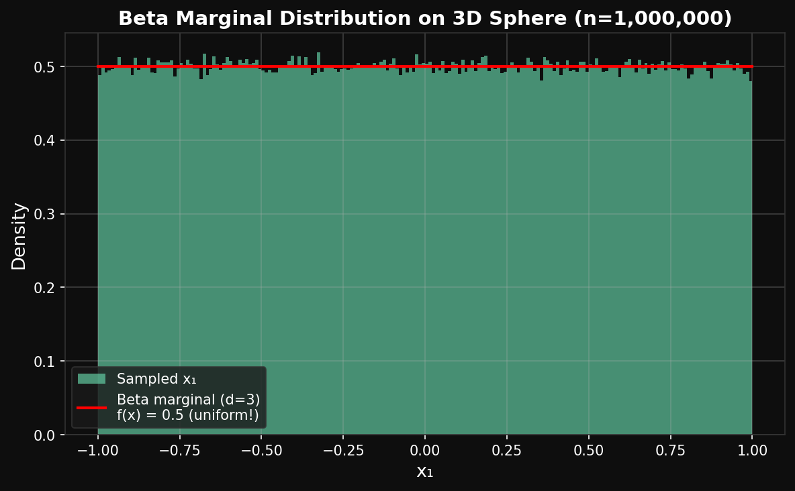
*Beta marginal PDF for a single coordinate of a uniform random point on the 3D unit sphere (Lemma 1 verification).*

---

### Phase 1 — Synthetic Validation (d=1536)

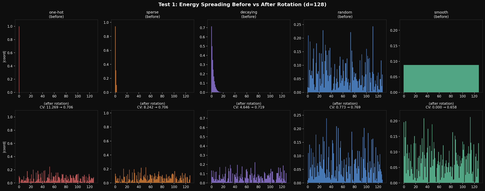
*Random rotation spreads uneven energy across all coordinates, enabling uniform scalar quantization.*

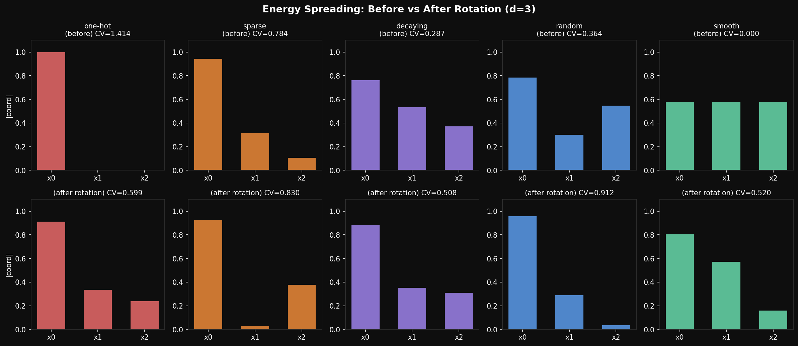
*Energy spreading illustrated in d=3 for visual clarity.*

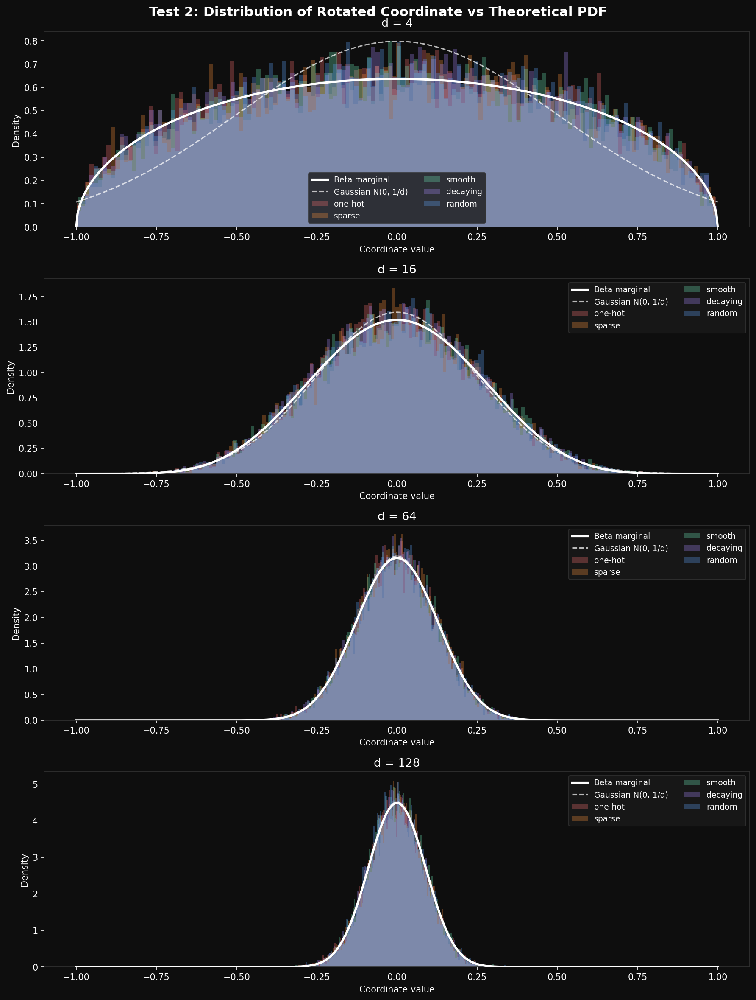
*Empirical distribution of rotated coordinates vs. theoretical Beta/Gaussian fit.*

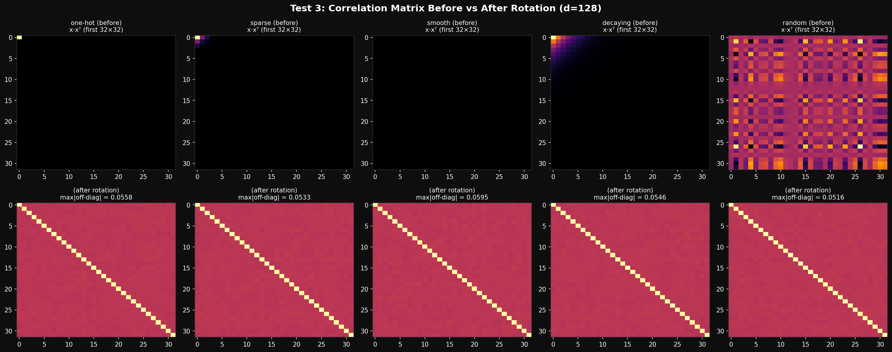
*Pair-wise correlation of coordinates after rotation — near-zero off-diagonal entries confirm near-independence.*

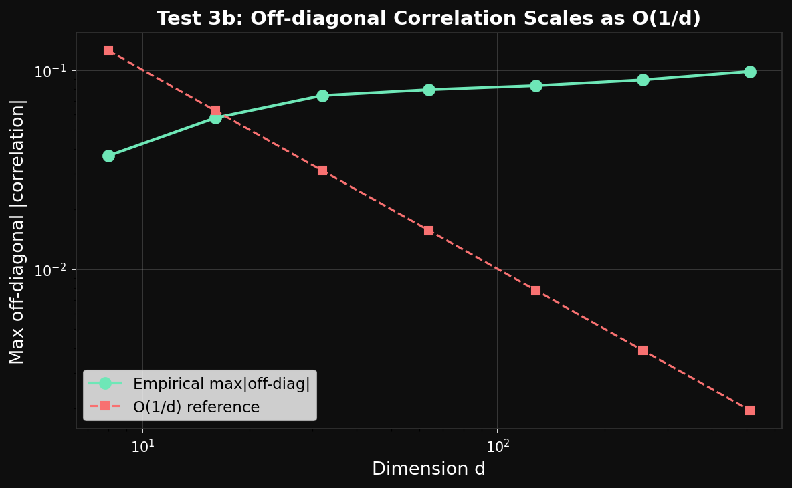
*Off-diagonal correlation decays as d increases, validating the independence assumption.*

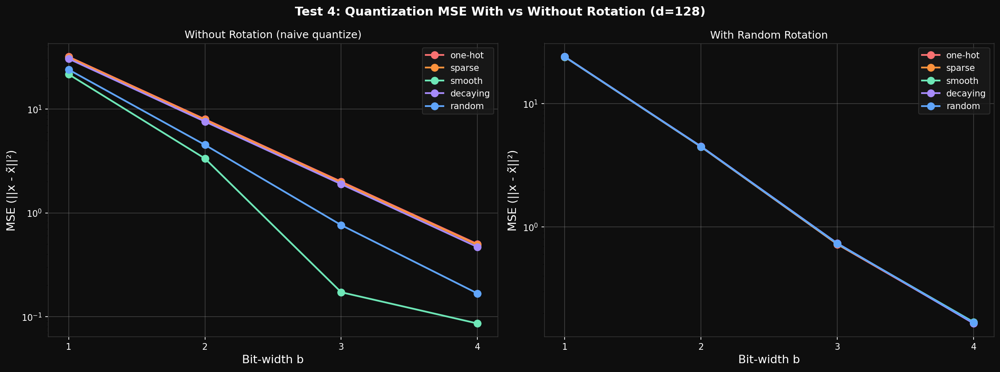
*Empirical MSE vs theoretical upper and lower bounds across bit-widths b=1..4 on synthetic unit vectors.*

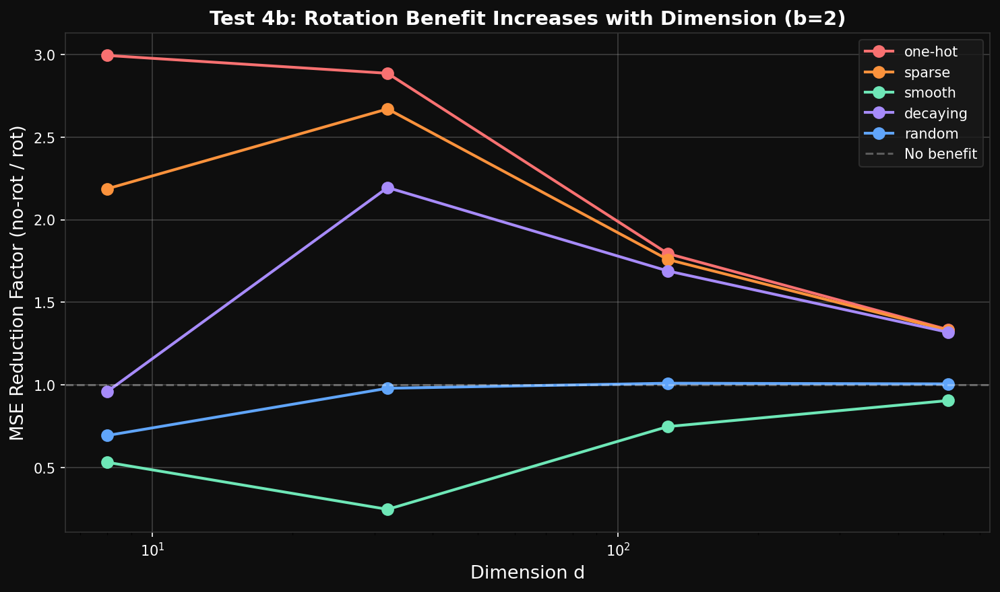
*MSE as a function of dimension d — confirms the distortion-rate bound scales correctly with d.*

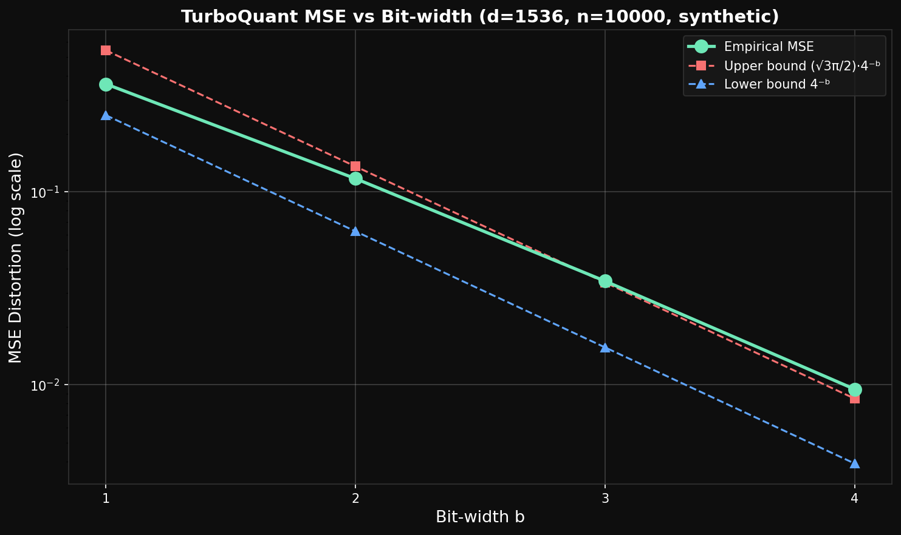
*Reproduction of Fig. 3 on synthetic data: empirical MSE lies between Shannon lower bound (1/4^b) and TurboQuant upper bound (√3π/2 · 4^(-b)).*

---

### Phase 2 — GloVe 300d

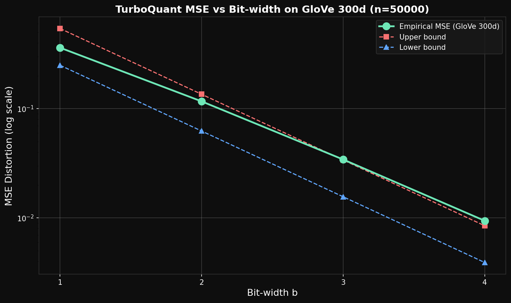
*Empirical MSE on GloVe 300d embeddings vs theoretical bounds for b=1..4. Confirms the algorithm works on real-world non-unit-sphere data.*

---

### Phase 3 — DBpedia 1536d (Paper Figures)

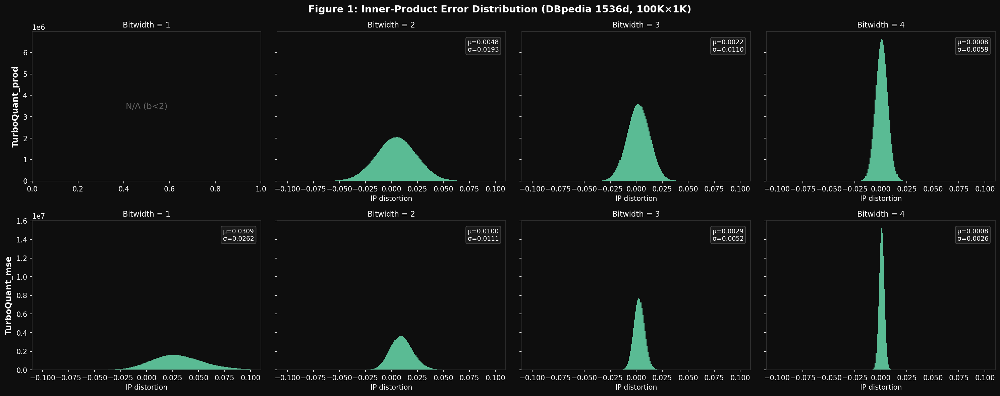
*Fig. 1 reproduction: inner-product error histograms for TurboQuant_prod (top) and TurboQuant_mse (bottom) at b=1,2,3,4. prod remains unbiased (centered at 0); mse shows rightward shift at low bit-widths.*

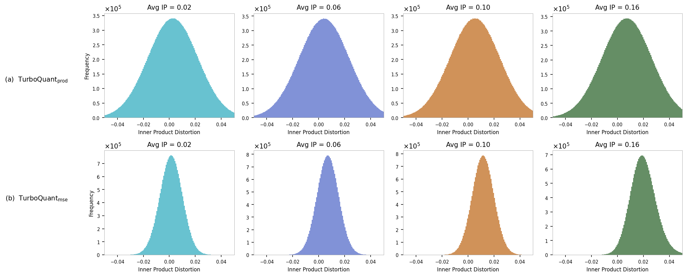
*Fig. 2 reproduction: inner-product error histograms at b=2, grouped by average inner product of each database vector. prod variance is constant across groups; mse variance grows with average inner product.*

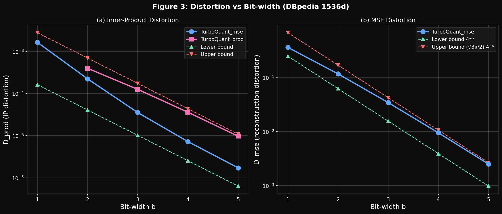
*Fig. 3 reproduction: empirical D_prod and D_mse vs bit-width b=1..5 on DBpedia 1536d. Both curves lie between theoretical bounds (dashed). At b=1, TurboQuant_mse exceeds the inner-product upper bound — expected, since it is biased for inner products at low bit-widths.*
