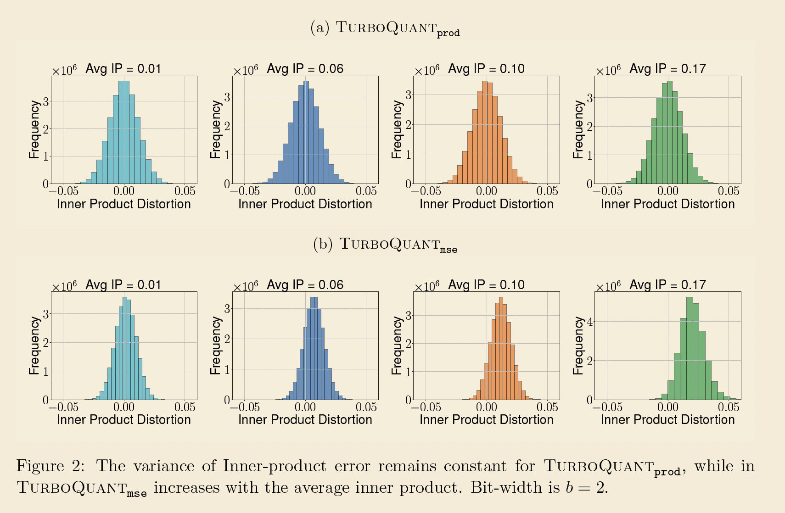

# Implementation details

MSE (Mean Square Error)
Results/graphs
Equations/Math
Potential Dataset

2 Stage process
1. Stage 1
2. Stage 2

# Dataset: 

D1: 
https://huggingface.co/datasets/Qdrant/dbpedia-entities-openai3-text-embedding-3-large-1536-1M

D2: 

https://huggingface.co/datasets/Qdrant/dbpedia-entities-openai3-text-embedding-3-large-3072-1M

D3: Glove dataset
https://downloads.cs.stanford.edu/nlp/data/glove.6B.zip

D4: Needle in haystack
https://github.com/gkamradt/LLMTest_NeedleInAHaystack

# Models 

Model Link HF: 
1. meta-llama/Llama-3.1-8B-Instruct
https://huggingface.co/meta-llama/Llama-3.1-8B-Instruct

2. bartowski/Meta-Llama-3.1-8B-Instruct-GGUF: https://huggingface.co/bartowski/Meta-Llama-3.1-8B-Instruct-GGUF

# Setup
2.5 bit and 3.5 bit quantization

Compare with the graphs

Following the experimental setup of Fu et al. [21], we conduct evaluations using the Llama-3.1-

8B-Instruct model. sweet spot between what was available, what was affordable, and what was convincing for an academic research paper at that time.

# Why shannon's source coding entropy is important?

How much can you compress information without losing it — and what's the absolute limit?

Shannon asked: given a budget of B bits, what's the minimum distortion you can possibly achieve? The answer is the distortion-rate function D(B), and no algorithm can do better than it — ever.

TurboQuant's distortion is within a factor of ~2.7 of Shannon's theoretical limit, which is remarkable — it means you physically cannot do much better regardless of how clever your algorithm is.

The core problem: LLMs are memory-bound, not compute-bound

# What exactly is cached? 
KV cache: Key and Values cached. 

- When generating token N, the model needs to compare the current query against every previous token's key, then weighted-sum their values. 
- Without caching you'd recompute K and V for all previous tokens every single step. The KV cache just saves those already-computed K and V vectors so you don't recompute them.

E.g.  
Llama 3.1 8B model: 32 layers, 8 KV heads, head_dim 128, FP16 = 2 bytes/float

layers × heads × 2 (K and V) × head_dimension floats
Per token: 32 x 8 x 2 x 128 x 2 bytes= 131 KB
for 128K context = 16GB for KV cache

# what is the ideal shannons equation? 

Absolute minimum given a specific budget  is given by the Lemma 3 (close to a theorem/paper)

D(B) ≥ 2^−2B/d

where: 

D(B) = minimum achievable distortion (MSE)
B = total bit budget
d = dimension of the vector

Double your bit budget (B→2B), the distortion drops by 4x. This is the fundamental compression-quality tradeoff — you pay exponentially in bits to gain linearly in quality.

